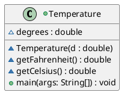
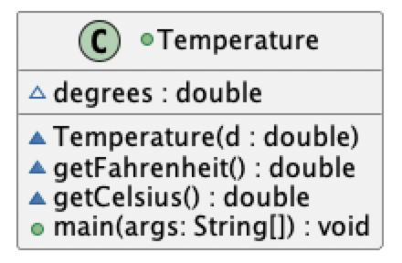
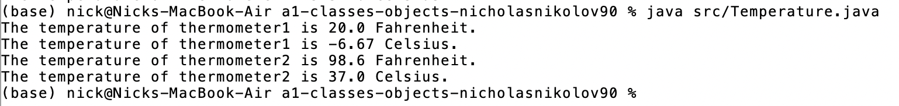

# Temperature report
Author: Nick Nikolov

## UML class diagram

## Specification
The class Temperature represents a temperature measurement in units of Fahrenheit
and allows for temperature conversion from Fahrenheit to Celsius.

## Execution and Testing

This shows a screenshot of the Temperature class UML diagram

This shows a screenshot of the Temperature class successful output of tests converting two temperatures 
from fahrenheit to celsius

