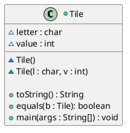
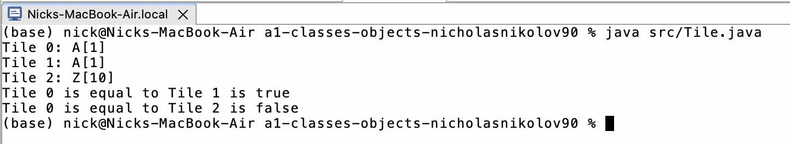
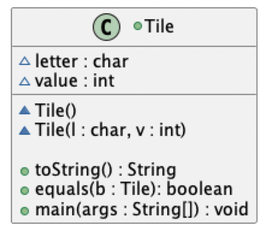

# Tile report
Author: Nick Nikolov

## UML class diagram

## Specification
The class Tile represents a tile used in the board game scrabble, each tile contains a letter and a point value and allows for the comparison between two tiles to check for equivalence

## Execution and Testing
This screenshot shows successful execution and test of the Tile class

This screenshot shows the UML diagram of the Tile class

# Reflection
I didn't understand clearly the purpose of the Tile program. The temperature program was much clearer about the objective of the program. I would have liked Tile better if I understood the purpose.
